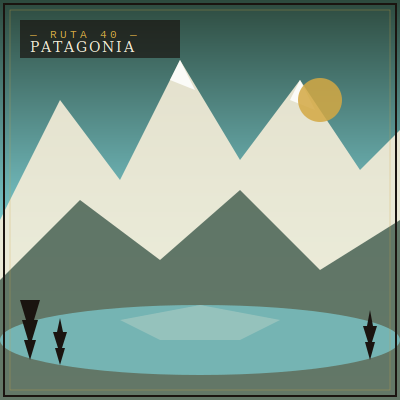
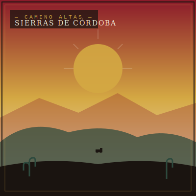
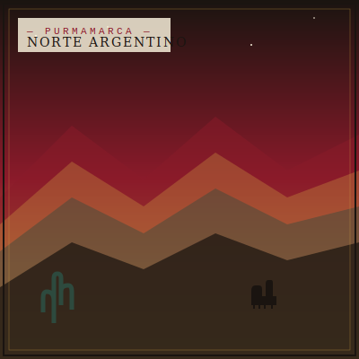

<div align="center">

</div>

<br/>

<div align="center">

### [la-caravana-club.vercel.app](https://la-caravana-club.vercel.app)

[](#)
[](https://la-caravana-club.vercel.app)
[](https://wa.me/5493541665284)
[](https://instagram.com/vanliferent.ok)
[](#)

</div>


## Landing de experiencia van life · Ecommerce conversacional · Editorial Patagonia

**La Caravana Club** — no es un alquiler de vans. Es un **club de expediciones curadas** en la Patagonia, las Sierras de Córdoba y el norte argentino. El sitio es la puerta de entrada. La conversión sucede en WhatsApp. Instagram retiene. Google captura intención de búsqueda.

Esto no es un Airbnb experience clonado. No es un funnel de marketing genérico con foto de paisaje. Es una **landing-producto** diseñada como un **objeto editorial**: tipografía Playfair, paleta crema-bordó-dorado, animaciones spring-physics, side panels click-to-expand, scroll horizontal de stickers, marquees opuestos, banners con efecto ink. El sitio respira con la marca — no es un template Tailwind con foto stock.

El producto se ensambla en tres planos: **web** (discovery + consideración), **WhatsApp** (intent + conversión), **Instagram** (retención + reactivación). Las tres superficies hablan el mismo lenguaje visual y comparten copy.

> *"La van llega a las 6 AM. Cargás mate, la guitarra, el perro. La ruta no tiene nombre todavía — eso es lo que vas a inventar."*


## Por qué importa estratégicamente

**Para el equipo de Vercel / Edge:**
La arquitectura demuestra que una landing de conversión de alto ticket (USD 400 – 1500 por experiencia) puede vivir como **static site puro** sin SSR, sin API routes, sin database. Vercel Edge sirve el HTML monolítico (220 KB) en menos de 80 ms en LATAM. Cero cold starts. Cero invoice de serverless. El **funnel se cierra fuera del sitio** — el contacto comercial ocurre en WhatsApp, no en un checkout Stripe que requiere backend.

**Para equipos de Producto / Travel Tech:**
La hipótesis es que en mercados emergentes con ticket alto, **el checkout web es el cuello de botella**, no el discovery. Argentina interior compra mejor por WhatsApp que por tarjeta web. El sitio elimina el checkout completo y reemplaza el flow `discovery → cart → pay` por `discovery → deeplink WA con contexto pre-armado → cierre humano`. Resultado: la landing es 100% storytelling — no compite por píxeles con un carrito.

**Para equipos de Diseño / Editorial:**
Cada sección está construida como **una página de revista impresa**. Hero con widget HUD, collage editorial asimétrico, marquees opuestos como banderines, slider de expediciones con badge %OFF tipo etiqueta de viaje, side panels spring-physics que se despliegan como folletos plegables, scroll horizontal de stickers como hoja de calcomanías. La inspiración no es Airbnb — es un National Geographic de los 70 cruzado con un fanzine.

**Para equipos de Front-End:**
220 KB de HTML monolítico con CSS y JS inline al final del body. Sin build step, sin bundler, sin framework. Mobile-first absoluto — el 80% del tráfico llega desde Instagram AD. JS vanilla con IntersectionObserver para scroll triggers, requestAnimationFrame para parallax, spring physics manual (`velocity += (target - current) * 0.12; velocity *= 0.75`) para los side panels de flota. **Time-to-edit-and-deploy: 30 segundos** — editar línea, commit, push, Vercel auto-deploy.


## Triple superficie · Web + WhatsApp + Instagram

El producto digital no es solo el sitio. Es la coreografía entre tres canales que comparten lenguaje visual y datos de contexto:

| Canal | Función en el funnel | UX touch específico |
|---|---|---|
| **Web** · `la-caravana-club.vercel.app` | Discovery + consideración | Hero parallax, slider expediciones con %OFF, flota con side panels spring, UGC grid con hover tilt |
| **WhatsApp** · `+54 9 3541 665284` | Intent + conversión | Deeplinks con mensaje pre-armado por sección de origen del click |
| **Instagram** · `@vanliferent.ok` | Retención + reactivación | UGC grid embebido en el sitio, próximamente con auto-pull vía Basic Display API |
| **Google** · Search + Reviews | Captura intención + prueba social | Schema.org `TouristTrip` (pendiente), embed de reseñas reales (pendiente) |
| **Email** · capture popup | Reactivación + drops mayo/oct | Form en pop-up 4s + banner Mayo Experience, integración Mailchimp pendiente |


## Secciones del sitio

<table>
<tr>
<td align="center" width="25%">
<br/>

<br/>
<b>Hero + Widget HUD</b>
<br/><br/>
<sub>Pantalla completa con parallax sobre starfield canvas. Tipografía Playfair Display 88px sobre fondo bordó editorial. Widget HUD inferior con coordenadas vivas, datos de la próxima salida, contador discreto. Spring physics en el scroll. La primera impresión vende el club entero — premium, curado, no genérico.</sub>
<br/><br/>
</td>
<td align="center" width="25%">
<br/>

<br/>
<b>Flota Vans</b>
<br/><br/>
<sub>Cuatro vans de la flota propia. Cada tarjeta es un rombo candy con icono de van, nombre, ruta sugerida y amenities (camas, pet-friendly, cocina, GPS, fogón). <em>Side panels spring-physics</em> que se despliegan al click — no modal, no pop-up: un folleto que se abre.</sub>
<br/><br/>
</td>
<td align="center" width="25%">
<br/>

<br/>
<b>Expediciones · Slider</b>
<br/><br/>
<sub>Carousel horizontal con badge %OFF animado (pulse cada 3.2 s). Cada card es una expedición curada: destino, duración, salida, plazas restantes. Hover lift con sombra cálida dorada. El CTA primario va a WhatsApp con mensaje pre-armado: <em>"Quiero info de [expedición X]"</em>.</sub>
<br/><br/>
</td>
<td align="center" width="25%">
<br/>

<br/>
<b>Mayo Experience</b>
<br/><br/>
<sub>Drop estrella. Banner editorial Playfair + foto van + email capture inline con focus ring dorado. -25% early bird hasta 15-abr. Pop-up de salida 4s después del scroll a esta sección. El único bloque con countdown sutil al lado de la fecha — sin urgencia agresiva.</sub>
<br/><br/>
</td>
</tr>
<tr>
<td align="center" width="25%">
<br/>

<br/>
<b>Argumento Económico</b>
<br/><br/>
<sub>Rombos candy con números grandes: cuánto cuesta un hotel + auto + comidas vs. cuánto cuesta sumarse al club. La comparación es honesta — no negamos que la van es más barata <em>y</em> más libre. Sin gráficos cursados, solo tipografía editorial sobre fondo crema.</sub>
<br/><br/>
</td>
<td align="center" width="25%">
<br/>

<br/>
<b>Valores y Garantías</b>
<br/><br/>
<sub>Iconos line blancos grandes sobre rombos crema. Sustentable, familia, local, experiencia completa, sin sorpresas, curtidos en ruta. Microcopy editorial debajo de cada uno — la página convierte porque se lee, no porque grita.</sub>
<br/><br/>
</td>
<td align="center" width="25%">
<br/>

<br/>
<b>UGC · Instagram Grid</b>
<br/><br/>
<sub>Grid 8 imágenes de la comunidad real, screenshots de <code>@vanliferent.ok</code>. Hover tilt 3D estilo HUD. Próximo paso: auto-pull vía Instagram Basic Display API para que el grid se actualice solo con el último contenido posteado.</sub>
<br/><br/>
</td>
<td align="center" width="25%">
<br/>

<br/>
<b>Stickers · Scroll Horizontal</b>
<br/><br/>
<sub>Doce stickers PNG branded en scroll horizontal con scroll-trigger por sección. Group 49–83 — calcomanías de van life para repartir en fogones, ploteos, cuadernos. Próximo: parallax tilt individual + cursor-follow para los stickers más prominentes.</sub>
<br/><br/>
</td>
</tr>
</table>


## Destinos curados

<table>
<tr>
<td width="33%"></td>
<td width="33%"></td>
<td width="33%"></td>
</tr>
</table>


## Flow de ecommerce conversacional

```
                ┌─────────────────────────────────────────┐
                │  DISCOVERY                              │
                │  Google Search · Instagram AD · WA      │
                │  → landing la-caravana-club             │
                └─────────────────────────────────────────┘
                                  │
                                  ▼
        ┌──────────────────────────────────────────────────────┐
        │  CONSIDERATION                                       │
        │  Hero parallax · Slider expediciones %OFF            │
        │  Flota side panels · Reseñas Google embed            │
        │  UGC Instagram grid · Stickers scroll horizontal     │
        └──────────────────────────────────────────────────────┘
                                  │
                                  ▼
        ┌──────────────────────────────────────────────────────┐
        │  INTENT                                              │
        │  Email capture popup 4s → WhatsApp deeplink          │
        │  Mayo banner → mensaje pre-armado WA                 │
        │  Booking form → resumen WA con datos                 │
        └──────────────────────────────────────────────────────┘
                                  │
                                  ▼
        ┌──────────────────────────────────────────────────────┐
        │  CONVERSION (sucede en WhatsApp, no en el sitio)     │
        │  +54 9 3541 665284 — cierre humano + seña por MP     │
        └──────────────────────────────────────────────────────┘
                                  │
                                  ▼
        ┌──────────────────────────────────────────────────────┐
        │  RETENTION                                           │
        │  Instagram @vanliferent.ok · contenido expediciones  │
        │  WhatsApp broadcast · reactivación drops mayo / oct  │
        └──────────────────────────────────────────────────────┘
```

### Mensajes WhatsApp pre-armados

| Trigger | Mensaje |
|---|---|
| Pop-up lead capture (4s) | `Hola — quiero pertenecer a La Caravana Club` |
| Banner Mayo Experience | `Me interesa info de las próximas expediciones` |
| Footer CTA prominente | `Hola — quiero pertenecer al club, ¿cuándo es la próxima salida?` |
| Booking form completo | Construido dinámicamente con van + fechas + ruta seleccionada |


## Decisiones de arquitectura

| Decisión | Por qué |
|---|---|
| **Vanilla JS sin framework** | Time-to-deploy primera versión: minutos. Sin reescritura cada 18 meses por framework treadmill. El código es un activo estratégico que sobrevive cambios de stack. |
| **HTML monolítico (CSS + JS inline)** | 220 KB single-file. Sin build, sin bundler, sin dependencias. Editar línea, commit, push, deploy en 30 s. La iteración con cliente es inmediata — no hay merge + CI + preview. |
| **Spring physics nativa** | `velocity += (target - current) * 0.12; velocity *= 0.75`. Fluidez táctil tipo iOS para los side panels de flota. Sin GSAP, sin Framer Motion, sin dependencias de animación. |
| **WhatsApp como checkout** | Ticket alto + customización alta + Argentina interior = WA convierte mejor que cualquier checkout Stripe. Elimina fees, fricción, abandono de carrito. |
| **Mobile-first absoluto** | 80% del tráfico viene de Instagram AD → mobile. Diseñar mobile, refinar desktop después. Sticky CTA WhatsApp después de scroll 60vh. |
| **SVG animado en el README** | El propio README es un objeto editorial. Banners ink-reveal, dividers de cordillera, circles con SMIL animations. Pesa kilobytes, no megabytes — funciona en todo GitHub theme. |
| **Additive only en el sitio** | Cada cambio es adición o refinamiento. CSS override con `!important` antes que refactorear el componente original. Lo que funciona no se toca. |


## Stack

```
HTML5 + CSS3 + Vanilla JS  →  index.html monolítico, CSS/JS inline al final del body
Google Fonts               →  Playfair Display · Inter · JetBrains Mono · Caveat
SVG con SMIL animations    →  banners, dividers, circles, footer — kilobytes, no megabytes
Vercel Edge                →  static site, cache headers para svg/png/jpg/woff2
WhatsApp Cloud API         →  deeplinks wa.me con mensaje pre-armado por sección
```

## Paleta

```css
--crema:        #F5EDD8;   /* fondo principal, calidez editorial */
--tinta:        #1A1410;   /* texto, casi negro cálido */
--borde:        #8B1A2A;   /* bordó — acento primario */
--dorado:       #D4A843;   /* highlight, CTA secundarios, focus rings */
--celeste:      #7ECFD4;   /* fresco, badges, windows van */
--turquesa:     #5BC8C0;   /* %OFF, urgencia suave */
--verde-ingles: #2D4A3E;   /* naturaleza, sombras de montaña */
--piedra:       #9B9186;   /* neutros, dividers */
```

## Tipografías

| Familia | Uso |
|---|---|
| **Playfair Display** | Títulos editoriales grandes, hero, banners, drop Mayo |
| **Inter** | Body copy, labels, navegación |
| **JetBrains Mono** | Datos, coordenadas, widget HUD, technical labels |
| **Caveat** | Notas handcraft, stamps, microcopy de comunidad |


## Estructura del repo

```
la-caravana-club/
├── index.html                    ← Landing principal (220 KB, CSS/JS inline)
├── README.md                     ← Este archivo
├── WORKFLOW_CLAUDE.md            ← Protocolo de iteración Claude Code + GitHub + Vercel
├── ASSETS_REGISTRY.md            ← Inventario de assets
├── vercel.json                   ← Config Vercel (cache headers, clean URLs)
├── .gitignore
│
├── css/
│   ├── variables.css             ← Tokens diseño (paleta, tipografías, spacing)
│   └── components.css            ← Estilos base reutilizables
│
├── assets/
│   └── icons/                    ← 17 SVG line-icons (camp-*.svg)
│
├── enhanced/
│   └── png/                      ← Stickers branding Group 49–83 (35 PNGs)
│
└── docs/                         ← Assets del README — todos SVG animados
    ├── banner.svg                ← Hero ink-reveal con van + montañas + título
    ├── divider-cordillera.svg    ← Separador cordillera bordó con ink filter
    ├── divider-ruta.svg          ← Separador ruta serpenteante con van animada
    ├── circle-fogata.svg         ← Llamas titilantes + sparks ascendentes
    ├── circle-van.svg            ← Van con headlight pulse + windows que cambian color
    ├── circle-luna.svg           ← Luna creciente + estrellas + 4-point star rotando
    ├── circle-ruta.svg           ← Ruta con van marker en animateMotion
    ├── sq-patagonia.svg          ← Escena Patagonia con snow peaks + lago
    ├── sq-sierras.svg            ← Escena Sierras de Córdoba con sun rays
    ├── sq-norte.svg              ← Escena Cerro de los 7 Colores + llama
    └── footer.svg                ← Guirnalda 18 bulbs titilantes + van + fogata
```


## Conexiones externas · Roadmap

| Servicio | Estado | Uso |
|---|---|---|
| **WhatsApp Business** | Activo | Deeplinks `wa.me/5493541665284?text=...` con mensaje pre-armado por sección |
| **Google Reviews API** | Pendiente | Embed reseñas reales en sección `#resenas` |
| **Google Analytics 4** | Pendiente | Tracking funnel discovery → click WA |
| **Meta Pixel** | Pendiente | Retargeting Instagram AD |
| **Instagram Basic Display** | Pendiente | UGC grid auto-pull `@vanliferent.ok` |
| **Mailchimp / ConvertKit** | Pendiente | Email capture → lista segmentada por sección de origen |
| **Google Calendar API** | Pendiente | Botón "agregar a calendario" en cards de expediciones |
| **MercadoPago link** | Pendiente | Link de seña enviado por WhatsApp |
| **Schema.org `TouristTrip`** | Pendiente | Rich snippets en Google para expediciones |

### Orden de integración propuesto

No conectar todo de una vez. Cada API agregada **debe medirse durante 2 semanas** antes de la siguiente — para aislar el lift y no contaminar el funnel.

```
GA4  →  Meta Pixel  →  Google Reviews  →  IG UGC  →  Mailchimp  →  MercadoPago  →  Calendar API
```


## Próximas iteraciones

### Identidad visual personalizada

- Banners custom Franco — reemplazar `enhanced/png/Group *.png` con artwork propio
- Logo 3D giratorio con delay de mouse (Three.js fiber, opcional)
- Banner Figma exportado entre secciones (1030 × 300 desktop · 440 × 50 mobile)
- Stickers PNG con fondo transparente y scroll-trigger por sección

### Microinteracciones

- Mousehover tilt 3D en cards de expediciones
- Cursor custom con trail dorado sobre CTAs
- Loading states animados en email capture
- Página de carga con starfield + logo morph
- Transiciones entre secciones tipo barba.js — sin reload

### Re-organización UX

- Reordenar secciones según mapa de calor de scroll
- Menú mejorado con dropdown de previews de expediciones
- Mega-menú mobile con tabs por destino
- Sticky CTA WhatsApp visible después de 60vh

### Ecommerce profundo

- Google Reviews API embed real
- Email capture → Mailchimp con tag por sección de origen
- Meta Pixel + GA4 + funnel tracking end-to-end
- Calendar embed con disponibilidad real por van
- App de información del vehículo (pop-up tipo card con specs + fotos + video walkthrough)

### Performance & SEO

- Lazy load imágenes con IntersectionObserver
- Preload del hero image + critical CSS inline
- OG tags completos para share en WhatsApp / Instagram preview
- Schema.org `TravelAgency` + `TouristTrip` markup
- Sitemap.xml + robots.txt


## Dev

```bash
# Cualquier static server:
npx serve .
# o
python -m http.server 4040
```

Abrir `http://localhost:4040`.

### Deploy en Vercel

```
1. New Project → Import desde GitHub
2. Framework Preset: Other (static)
3. Build Command: vacío
4. Output Directory: vacío (root)
5. Deploy → la-caravana-club.vercel.app
```

Auto-deploy activo en cada push a `main`.

<br/>


